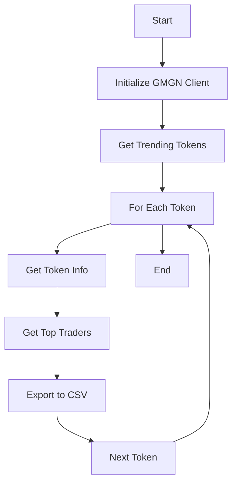

# GMGN.AI Data Analysis Tool

This project is a Python-based tool for analyzing trading data from GMGN.AI platform, focusing on cryptocurrency token analysis and trader tracking on the Solana blockchain.

## Project Structure

```
gmgn/
├── gmgn.ai/           # Main application code
├── data/              # CSV data storage
├── testing/           # Testing scripts and data
└── env/               # Python virtual environment
```

## Features

- Token Information Retrieval
- Top Trader Analysis
- Trending Token Tracking
- Data Export to CSV
- Custom Time Frame Analysis
- Multiple Trading Metrics:
  - Unrealized Profit
  - Realized Profit
  - Buy/Sell Volumes
  - PnL Analysis

## Installation

1. Clone the repository:
```bash
git clone [repository-url]
cd gmgn
```

2. Create and activate a Python virtual environment:
```bash
python -m venv env
source env/bin/activate  # On Unix/macOS
# or
env\\Scripts\\activate  # On Windows
```

3. Install required dependencies:
```bash
pip install -r requirements.txt
```

## Usage

The main application can be run using:

```bash
python gmgn.ai/main.py
```

### Available Functions

- `getTokenInfo(contractAddress)`: Get detailed information about a specific token
- `getTrendingTokens(timeframe)`: Get list of trending tokens in a specific timeframe
- `getTopTraders(address, name)`: Get top traders for a specific token
- `getTrendingWallets(timeframe, walletTag)`: Get trending wallets based on performance

## Project Components

### 1. GMGN.AI Module
Located in `gmgn.ai/`, this is the main application module containing:
- `main.py`: Entry point and main execution flow
- `modules/`: Core functionality modules

### 2. Data Storage
Located in `data/`, stores CSV files containing:
- Top trader data for various tokens
- Trading performance metrics
- Historical data analysis

### 3. Testing
Located in `testing/`, contains:
- Test scripts
- Sample data files
- Verification tools

## Flow Chart



## Requirements

- Python 3.12+
- curl-cffi
- requests
- pandas
- numpy

## Contributing

1. Fork the repository
2. Create your feature branch
3. Commit your changes
4. Push to the branch
5. Create a new Pull Request

## License

This project is licensed under the MIT License - see the LICENSE file for details

---

For more detailed information about specific components, please check the README files in each subdirectory:
- [GMGN.AI Module Documentation](./gmgn.ai/README.md)
- [Testing Documentation](./testing/README.md)
