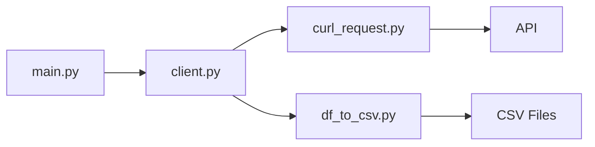

# GMGN.AI Core Module

This directory contains the core functionality of the GMGN.AI data analysis tool.

## Directory Structure

```
gmgn.ai/
├── main.py           # Main entry point
└── modules/          # Core modules
    ├── __init__.py
    ├── client.py     # GMGN API client
    ├── curl_request.py # HTTP request handling
    └── df_to_csv.py  # Data export utilities
```

## Module Components

### 1. main.py
The entry point of the application that orchestrates all operations:
- Initializes the GMGN client
- Processes token data
- Manages data flow between modules

### 2. modules/client.py
The GMGN API client implementation:
- Handles API authentication
- Provides methods for data retrieval
- Manages API endpoints and responses

Key Functions:
```python
getTokenInfo(contractAddress: str) -> str
getTrendingTokens(timeframe: str) -> list
getTopTraders(address: str, name: str)
getTrendingWallets(timeframe: str, walletTag: str)
```

### 3. modules/curl_request.py
Handles HTTP requests to the GMGN.AI API:
- Manages session cookies
- Handles request headers
- Processes API responses

### 4. modules/df_to_csv.py
Data processing and export utilities:
- Converts API responses to DataFrames
- Handles CSV file export
- Manages data formatting

## Flow Diagram



## API Endpoints

The module interacts with the following GMGN.AI API endpoints:

1. Token Information:
```
GET /defi/quotation/v1/tokens/sol/{token_address}
```

2. Top Traders:
```
GET /defi/quotation/v1/tokens/top_traders/sol/{token_address}
```

3. Trending Tokens:
```
GET /defi/quotation/v1/rank/sol/tokens/{timeframe}
```

## Usage Example

```python
from modules.client import gmgn

# Initialize client
client = gmgn()

# Get trending tokens
tokens = client.getTrendingTokens("6h")

# Process each token
for token in tokens:
    address = token['address']
    name = client.getTokenInfo(address)
    client.getTopTraders(address, name)
```

## Configuration

The module uses the following environment variables:
- Headers and cookies for API authentication
- Base URL configuration
- Request parameters

## Error Handling

The module implements error handling for:
- API connection issues
- Rate limiting
- Invalid responses
- Data processing errors

## Development

When adding new features:
1. Update the appropriate module
2. Add necessary API endpoint handlers
3. Implement data processing logic
4. Update documentation
5. Add error handling

## Testing

Test files for this module are located in the `/testing` directory. Run tests using:

```bash
python -m unittest discover testing
```
